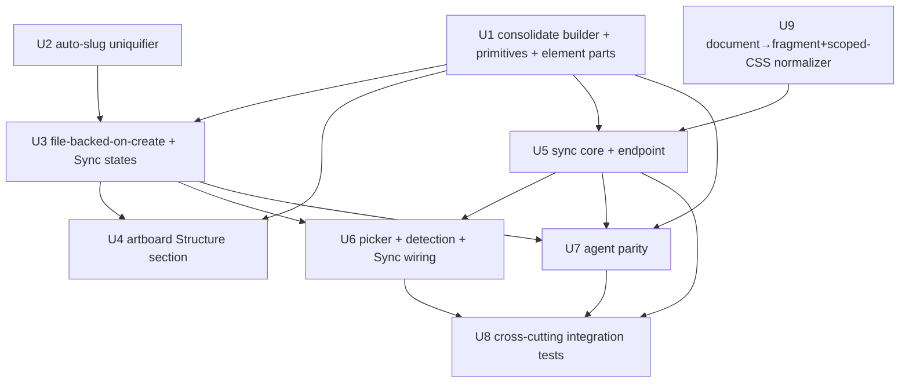

# feat: Web-native canvas authoring, file-backed-on-create, Sync to picked project

## Overview

Make canvas authoring produce real, importable code. Native HTML components
become file-backed at creation (no separate "Save" step). An artboard
"Structure" section adds a grid picker, a structural preview, and basic
layout-primitive and element-part builders composed with `data-slot` regions.
A single Sync action normalizes the source (extracts the component body, hoists
and scopes its CSS, strips authoring attributes), optionally generates a TSX
artifact, and publishes into a user-picked external project folder whose
components directory is auto-detected. Agents reach every step through the same
files and write path.

This builds on the shipped native-composition system
(`docs/plans/2026-05-16-001-feat-canvas-native-composition-plan.md`) and reuses
its slot model, AST round-trip, registry, and directory-pick plumbing. The two
net-new pieces of infrastructure are the path-safe out-of-repo sync endpoint
and the document→fragment+scoped-CSS normalizer.

> **Spec amendment (2026-05-17 review):** The approved spec's "Clean output"
> decision said clean-export only strips authoring attributes. Review found the
> canonical Root A `.html` artifact is a full `<!doctype html>` document (the
> shell builder emits `<head><style>…</style></head><body>`), so attribute
> stripping alone does not yield importable code and inline-embed would collide
> N document `<style>` blocks. This plan amends "Clean output" to also extract
> the component body and hoist+scope the document CSS (U9). The canvas keeps the
> full document as the working source (the iframe needs it); only the published
> Root B artifact is the fragment+scoped-CSS.

---

## Problem Frame

Today native components start inline and require an explicit "Save as
component" step before they are code; the artboard has no fast structural
scaffolding; and there is no path from a composed artboard/component to a real
project a team ships. The spec (see origin) resolves this: authoring *is*
editing code, and one Sync action publishes clean web-native code into a real
project, with full agent parity. Two sandbox roots exist and must never be
conflated: **Root A** = repo working copy `projects/<id>/` (canonical for
*editing*, mtime-guarded, holds the full working document), **Root B** = the
user-picked external folder (publish target, holds the normalized
fragment+CSS, overwrite-by-slug, never read back).

---

## Requirements Trace

- R1. Native components are file-backed at creation (auto-slug); the separate "Save as component" step is removed; a single Sync button carries `Sync` / `Syncing…` / `Re-sync` / `Synced` / error states.
- R2. Canonical working source is the web-native HTML document; the published artifact is normalized HTML+CSS; TSX is a deterministic one-way generated artifact, gated by an `HTML` | `HTML + TSX` panel toggle; a detected React project suggests `HTML + TSX`.
- R3. Basic layout-primitive builders (Stack, Row/Cluster, Grid, Split/Sidebar, Center, Cover, Frame) AND element-part builders (containers `div/section/header/footer/figure`, text `h1`–`h6`/`p`/`span`/`ul`/`ol`/`li`, `a`, `button`, `img`, `svg`, `video`); named templates are pre-composed primitives with `data-slot` regions.
- R4. Artboard "Structure" panel section: grid picker (Flex/Grid, Columns 1–5, gap) + structural preview thumbnail + template picker that lays a file-backed slotted shell as an artboard child. The Structure section **replaces** the existing standalone Flex/Grid/Columns/Gap controls in the artboard panel (single authoritative layout control, no duplication).
- R5. Slot fill reuses the existing per-slot picker unchanged.
- R6. Sync target is a user-picked external project folder; the components dir is auto-detected (probe `src/components`, `app/components`, `components`, `src/ui`, `lib/components` + framework sniff), shown for override, and the mapping persists per project.
- R7. Re-sync overwrites in place by slug. The user sees a non-blocking "overwriting existing file(s)" notice listing affected files; prior Root B content is not restored on failure (VCS owns history) — see R10 for the explicit guarantee.
- R8. The published artifact is normalized: component `<body>` content extracted, document `<style>` hoisted into a sibling slug-scoped `.css`, authoring attributes (`data-slot*`, canvas-only `data-*`, injected ids) stripped via an explicit denylist; `data-component`, ARIA, and semantic attributes preserved; the working Root A source keeps the full document and metadata.
- R9. Selecting a component syncs its normalized files; selecting an artboard syncs the page (composition with inline-embedded children, each child's CSS scoped so cascades do not collide) plus every child component; idempotent by slug; a manifest with a defined schema is written.
- R10. A new path-safe `/api/canvas/project/sync` endpoint writes outside the repo root, sandboxed to the picked dir, traversal- and symlink-rejected (realpath re-checked at write time), localhost/origin-guarded; AST endpoints stay Root A only; multi-file writes are all-or-nothing where "rollback" means the staged batch is discarded before any rename — once renames begin, prior overwritten Root B content is NOT restorable and this is stated to the user.
- R11. Agent parity: `create_native_component_shell` extended (template + grid + slots + element parts, file-backed, single shared builder) and a new `sync_to_project({ target, componentsDir?, format?, selection })` whose `target` must match a previously user-confirmed root (allowlist); deterministic defaults; defined response shape.
- R12. Stale-source guard: the sync endpoint reads all Root A sources for the selection from disk at sync time, captures their mtimes, and aborts before any Root B write if any source's mtime diverges from the client's last-known value (artboard sync = N sources, all checked).
- R13. Document→fragment+scoped-CSS normalization is a first-class, tested transform owned by a dedicated unit; it is the precondition for clean-export, inline-embed, and HTML→TSX.
- R14. HTML is a first-class basic primitive node: a paste-arbitrary-code path (inline editor → live `CanvasHtmlFrame` render → iterate) that is file-backed-on-create and reachable identically by manual action and by agent (`create_component_from_html` / `create_native_component_shell`), and duplicable by agent (`duplicate_nodes`). Largely shipped (inline-HTML textarea + frame render + MCP create/duplicate); this plan only makes the paste-code create path file-backed (via U3) and ensures element-part primitives exist (U1) — no new node type.

---

## Scope Boundaries

- Internal `projects/<id>/` as a sync target (Root B is external only).
- Bidirectional HTML↔TSX (TSX is generated one-way; never parsed back).
- Component-reference page embedding (artboard page inlines children, CSS-scoped).
- Conflict detection / merge / prior-content restore on Root B re-sync.
- Switcher / Inline primitives, `table`, `iframe`, multi-page/routing.
- A new cell/placeholder data type; movable per-region canvas children.
- Template authoring UI (templates are code-defined builders).
- CSS minification (output stays readable; scoping is structural, not minifying).
- Automatic deletion/pruning of abandoned file-backed components (orphan
  lifecycle is an Open Question, not built in v1).

### Deferred to Follow-Up Work

- Reverse import of Root B hand-edits: out of scope by design; documented, not built.
- Non-Chromium directory-picker parity beyond the server-path-entry fallback.
- Orphan-component cleanup/prune capability (see Open Questions).

---

## Context & Research

### Relevant Code and Patterns

- `utils/canvasNativeComponentShell.ts` — **already exists** (committed `176dc29`) with `buildNativeComponentShell`, `NATIVE_COMPONENT_TEMPLATES`, `escapeHtmlText`; `CanvasNativeComponentDialog.tsx` already imports it. There are **three divergent copies** of the builder: this util, a stale duplicate at `components/canvas/CanvasTab.tsx:237` (still called by `handleAddNativeComponent:2631`), and an independent copy in `utils/canvasAgentOperations.mjs:393` (called `:837`). U1 consolidates these, it does not "create" the file.
- `components/canvas/CanvasTab.tsx` — `handleAddNativeComponent` (~`:2625`), `handleAddInlineHtml` (~`:2521`), `nativeComponentTargetArtboard` (~`:1297`).
- `components/canvas/CanvasHtmlPropsPanel.tsx` — `handleSaveAsComponent` (~`:446`) writes `draftSourceHtml` **verbatim** (full document) to Root A; its rebind shape (`sourceHtmlFilePath`/`sourceHtmlFileMtime`, ~`:467`) is the file-backed-on-create logic to move; per-slot pickers (`buildSlotStarter` `:96`, exported `buildSlotComponentInsertion` `:138`, `buildSlotNativePartInsertion`/`listSlotNativePartOptions`) reused unchanged.
- `vite/api/canvasComponentCreate.ts` — `applyCanvasComponentCreateRequest`, `writeComponentFilesAndRegistry` (~`:130`); its catch block only `fs.rm`s tmp files (~`:208,220`) and does **not** un-rename committed files — the named rollback precedent provides no un-rename machinery. `extractRegistrySlotsFromHtml` (~`:266`); 409 on collision (no auto-rename today).
- `vite/api/canvasAstWrite.ts` — exported `resolveWorkspacePath` (~`:255`, repo-scoped), `normalizeMutations` (~`:268`) incl. `swapTag`, mtime optimistic-concurrency (~`:141`, 1ms tolerance), atomic tmp+rename. AST endpoints are concurrent and guard only their own single file.
- `utils/canvasHtmlEditor.ts` — `writeCanvasHtmlNode`, `readCanvasHtmlNode`, `listCanvasHtmlSlots`, `extractHtmlSubtree` (~`:823`, strips only `data-canvas-id`; does NOT extract/scope CSS).
- `utils/canvasRegistry.ts` — `CanvasRegistryPrimitive` (~`:10`), `parseCanvasRegistry` (~`:29`); `registry.json` `{ ui: [], page: [] }`.
- `components/canvas/CanvasSidebar.tsx` — `showDirectoryPicker` is called with **no mode** (~`:785`) and its handle is used only to read files in-browser via `collectDirectoryHandleFiles`; the browser handle cannot be used by the Node sync endpoint. The real write mechanism for ALL browsers is a **server-validated path string** (the "Filesystem root (advanced)" entry, ~`:1759`); the picker only yields a directory name/path for the server.
- `vite.config.ts` — single dev-middleware API host; canvas routes ~`:4462–4560`; `readProjectMeta`/`writeProjectMeta`/`ensureProjectScaffold` ~`:649–760` are generic `project.json` JSON read/write — `meta.syncTarget` is a sibling key like `localScan`.
- `components/canvas/CanvasArtboardPropsPanel.tsx` — `layout` shape (~`:16`), Flex/Grid toggle (~`:353`), Columns input (~`:446`), Gap/Padding fields; scroll container ~`:137–494`. `CanvasArtboardItem.tsx` — `getGridColsClass` (~`:71`).
- `utils/agentNativeManifest.ts` — tool registry; manifest test asserts every id is wired. `utils/canvasAgentOperations.mjs` agent runtime.
- `eslint.config.js` — client-import guard (no `node:*`/`fs` in `utils/**/*.ts` shared/client code; `vite/api/**` is not in lint targets).

### Institutional Learnings

- Client-import guard (commits `23fbcaf`, regression `0e7de4e`): keep clean-export/normalizer/HTML→TSX/slug helpers pure-JS; all `fs`/path strictly in `vite/api/`.
- `resolveWorkspacePath` is the canonical traversal guard but repo-scoped; generalize its shape for an arbitrary picked root, add `fs.realpath` containment, and re-check realpath immediately before the rename to close the check-then-use window.
- AST round-trip has a recast/TS-AST bridge with prior bugs (`8d94854`); keep HTML→TSX strictly one-way/deterministic; mirror the existing writer envelope (`5906b53`).
- Slot model + `registry.json` `slots[]` shipped (`fbf33c5`, `c6f2a47`, `a034720`); reuse, do not redesign.
- No `docs/solutions/` KB exists — run `/ce-compound` after this lands (path-safety generalization, document-normalization, client/server boundary).

### External References

- None used. Local patterns are strong; the security pattern to generalize is in-repo.

---

## Key Technical Decisions

- **Document normalization is its own unit (U9), upstream of sync.** The shell
  builder keeps emitting full documents (the canvas iframe renders them). On
  Sync, U9 extracts `<body>` inner HTML as the component markup and hoists the
  document `<style>` text into a sibling `.css`, **scoped under a generated
  per-slug wrapper selector** (e.g. `[data-component="<slug>"]`) so that
  artboard inline-embed of N children cannot collide `body{}`/`*{}`/bare-tag
  rules. Bare-tag and `body`/`:root` selectors in the hoisted CSS are rewritten
  to descendants of the wrapper. This is the amended "Clean output" model.
- **Rollback guarantee, stated honestly.** "All-or-nothing" means: stage all
  files to tmp, validate all (normalization + TSX gen), and only then begin the
  rename batch. If validation fails, nothing is renamed (true all-or-nothing).
  If a rename fails mid-batch, already-renamed Root B files cannot be restored
  to their prior content (overwrite-by-slug already destroyed it; no pre-rename
  backup in v1). The endpoint reports which files were written and which were
  not; the UI states "prior content not recoverable — your VCS has history."
  The cited `writeComponentFilesAndRegistry` only deletes tmp files; U5 builds
  the discard-staged-batch logic new, it does not "extend" un-rename.
- **Two-guard separation + realpath-at-write.** AST endpoints keep
  `resolveWorkspacePath(__dirname)`. The sync endpoint uses a separately
  instantiated `resolveSandboxPath(pickedRoot)` with an `fs.realpath`
  containment check **and re-runs realpath on the final target immediately
  before `fs.rename`**, rejecting if it diverged (closes the check-then-use
  window on the higher-risk external root). The root parameter is never shared.
- **Persisted root re-validated by realpath each re-sync.** On every re-sync,
  `fs.realpath(rootPath)` is run and compared to the value resolved at
  `mappedAt`; divergence aborts and prompts re-pick (existence alone is not
  sufficient — a swapped symlink passes an existence check).
- **Slug is validated as a single path segment** (no `/`, `..`, null bytes,
  leading `.`) at the create endpoint and again before any Root B path join,
  before `resolveSandboxPath` runs as the backstop.
- **Manifest is a staged batch member.** `manifest.json` is written through the
  same `resolveSandboxPath` guard (`.json` in the allowlist) and is part of the
  atomic stage→validate→rename batch, not a post-batch write. Schema:
  `{ version, components: [{ slug, files: [...], slots: [...], syncedAt }], pages: [{ slug, files: [...], children: [slug...], syncedAt }] }`.
- **Multi-file artboard snapshot coherence.** For an artboard sync the endpoint
  reads page + every child from disk, records each mtime, then before any Root B
  write re-stats all sources; if any mtime advanced during the read (a
  concurrent AST write) it aborts (no partial/incoherent publish). The U8
  in-flight lock only serializes Sync-vs-Sync; this rule covers Sync-vs-AST.
- **Endpoint is localhost/origin-guarded.** `/api/canvas/project/sync` rejects
  requests whose `Origin`/`Host` is not localhost; the plan documents that the
  dev server must bind `127.0.0.1`. This is required because the endpoint
  widens write scope to arbitrary external filesystem locations.
- **Agent `target` is allowlisted.** `sync_to_project`'s `target` must match a
  `rootPath` previously confirmed by a user UI pick session (recorded in
  `project.json`); an agent cannot nominate an arbitrary new Root B. Ambiguous
  detection with no explicit `componentsDir` is an error, not a guess.
- **Detection reads a fixed safe subset of `package.json`** (dependency key
  names only, for framework sniff); no `package.json` value is used as a path
  segment; the detected `componentsDir` is HTML-escaped before panel display.
- **Shared single builder; retire the `.mjs` copy.** U1 consolidates the three
  `buildNativeComponentShell` copies into `utils/canvasNativeComponentShell.ts`
  (+ a generated/derived `.mjs` runtime view, not a hand-maintained twin) so
  UI and agent cannot diverge; `canvasAgentOperations.mjs:393`'s copy is removed
  and rewired to the shared builder.
- **`canvasHtmlToTsx` lives inside the sync endpoint for v1** (private function,
  tests in `canvasProjectSync.test.ts`) rather than a standalone exported
  module — single consumer, edge rules deferred; extract later if a second
  consumer appears.

---

## Open Questions

### Resolved During Planning

- Slug collision: uniquify file + registry id together (no 409 for native-create).
- Root B guard: separately instantiated generalized validator + realpath, re-checked at rename; AST endpoints untouched.
- Folder mapping persistence: `project.json` `meta.syncTarget`.
- HTML→TSX failure: aborts the whole selection (stage-all-then-commit).
- Clean output: amended to U9 normalization (body extract + CSS hoist+scope) + attribute denylist; `data-component`/ARIA preserved.
- Agent folder pick: `sync_to_project` `target` allowlisted to user-confirmed roots.
- Structure vs Layout: Structure section replaces the standalone layout controls (single authoritative control).

### Deferred to Implementation

- Exact normalization edge rules: multiple `<style>` blocks, `<link rel=stylesheet>`, inline `style=""` retention, `:root`/`@media`/`@keyframes`/`@font-face` hoisting under a wrapper, `<script>` handling — settle in U9 against the real shells; keep deterministic and one-way.
- Exact HTML→TSX transform edge rules (self-closing, boolean attrs) — settle in U5 against U9 output.
- Structural-preview thumbnail technique (proportional CSS rectangles preferred) — choose in U4.

### Deferred (Product / Lifecycle — not v1)

- Orphan lifecycle: file-backed-on-create + auto-slug means abandoned drafts accumulate in `projects/<id>/components/` and the registry/library/slot pickers. v1 accepts this churn; a delete/prune capability is explicit follow-up. Mitigation considered and deferred, not overlooked.
- First-sync interaction cost vs the removed single "Save" click: accepted; steady-state re-sync is one click.

---

## High-Level Technical Design

> *This illustrates the intended approach and is directional guidance for review, not implementation specification. The implementing agent should treat it as context, not code to reproduce.*

```
 Canvas / Agent
      │  create (file-backed, full document)   edit (round-trip)
      ▼
 ┌─────────────────────────────────────────────┐
 │ Root A  projects/<id>/  (CANONICAL, EDITING) │
 │  components/<slug>.html  = FULL <!doctype>   │
 │  guard: resolveWorkspacePath(__dirname)      │
 └─────────────────────────────────────────────┘
      │  Sync (component | artboard)
      ▼  read all sources + snapshot mtimes + stale gate
 ┌─────────────────────────────────────────────┐
 │ U9 normalize: extract <body> +               │
 │   hoist <style> → sibling .css scoped to     │
 │   [data-component=slug]; strip data-slot* etc│
 │ → optional HTML→TSX (one-way, deterministic) │
 │ → stage ALL (incl manifest) to tmp           │
 │ → validate ALL → atomic rename batch         │
 │   (fail-before-rename = true all-or-nothing) │
 └─────────────────────────────────────────────┘
      │  /api/canvas/project/sync (localhost-guarded)
      ▼  resolveSandboxPath(pickedRoot)+realpath@rename
 ┌─────────────────────────────────────────────┐
 │ Root B  <picked>/<componentsDir>/  (PUBLISH) │
 │  <slug>.html (fragment) + <slug>.css         │
 │  (+ <slug>.tsx)  manifest.json               │
 │  overwrite-by-slug, never read back          │
 └─────────────────────────────────────────────┘
```



---

## Implementation Units

- U1. **Consolidate the shell builder; add layout-primitive + element-part builders**

**Goal:** Collapse the three divergent `buildNativeComponentShell` copies into the single existing `utils/canvasNativeComponentShell.ts`, add the basic layout-primitive templates AND element-part builders, and provide a derived `.mjs` runtime view so UI and agent share one implementation.

**Requirements:** R3, R11

**Dependencies:** None

**Files:**
- Modify: `utils/canvasNativeComponentShell.ts` (extend in place — file already exists; add layout primitives + element parts)
- Modify: `components/canvas/CanvasTab.tsx` (delete the local `:237` copy; import the shared util)
- Modify: `utils/canvasAgentOperations.mjs` (delete the `:393` copy; call the shared builder via the derived `.mjs` view)
- Create: `utils/canvasNativeComponentShell.mjs` (derived runtime view of the `.ts`, not a hand-maintained twin)
- Modify: `components/canvas/CanvasNativeComponentDialog.tsx` (template list incl. element parts; copy says "file-backed")
- Test: `tests/canvasNativeComponentShell.test.ts`

**Approach:**
- First reconcile: confirm the existing util is the source of truth, delete the two duplicates, rewire callers. Then add the seven layout-primitive templates (grid/flex roots + `data-slot` regions) and the element-part builders (single idiomatic element shells, no `data-slot` needed). Pure JS, no `fs`/`node:*`.
- The `.mjs` view must be generated from or trivially derived from the `.ts` so they cannot drift; do not hand-maintain a parallel copy.

**Patterns to follow:** existing `NATIVE_COMPONENT_TEMPLATES`; shipped `card`/`hero` `data-slot` shape.

**Test scenarios:**
- Happy path: each layout-primitive id returns well-formed HTML with expected `data-slot` regions and a grid/flex root.
- Happy path: each element-part id returns a single well-formed element shell with no `data-slot`/canvas artifacts.
- Happy path: `listCanvasHtmlSlots` over each layout shell yields documented slot names/kinds.
- Edge case: empty title → default; HTML-special chars escaped.
- Edge case: unknown id → documented default, no crash.
- Integration: the `.ts` and derived `.mjs` produce semantically equivalent output for every id (same slot set, same tag tree) — semantic equality, not byte equality (the two are derived, not hand-kept).
- Integration: no remaining references to the deleted `CanvasTab.tsx:237` / `canvasAgentOperations.mjs:393` builders (grep assertion).

**Verification:** One builder implementation; UI and agent both resolve to it; layout primitives and element parts both available.

---

- U2. **Auto-slug uniquifier in the component-create endpoint**

**Goal:** Replace 409-on-collision with a uniquifier so file-backed-on-create never fails on a name clash.

**Requirements:** R1

**Dependencies:** None

**Files:**
- Modify: `vite/api/canvasComponentCreate.ts`
- Test: `tests/canvasComponentCreate.test.ts`

**Approach:** Before writing, if `<slug>.html` exists or `primitive/<slug>` is in the registry, advance `<slug>-2`, `<slug>-3`, … until both the filename and registry id are free, allocated as a pair. Validate the slug as a single path segment (no `/`, `..`, null bytes, leading `.`) before use. Preserve traversal guard, atomic tmp+rename, rollback. Keep explicit-409 for non-native opt-out callers (request flag, default = uniquify).

**Patterns to follow:** `writeComponentFilesAndRegistry`; `toKebabCase`/`normalizeComponentName`.

**Test scenarios:**
- Happy path: first "Card" → `card.html` / `primitive/card`.
- Edge case: "Card" twice → `card-2.html` + `primitive/card-2`, paired.
- Edge case: filename free but registry id taken (or vice versa) → advance until both free.
- Error path: slug that is not a single path segment → rejected before any write.
- Integration: registry stays `parseCanvasRegistry`-valid after uniquified insert.

**Verification:** Repeated native creates never 409; names/ids paired, unique, path-safe.

---

- U3. **File-backed-on-create, remove Save step, Sync button state machine**

**Goal:** Native creation writes a real file and rebinds the item immediately; the "Save as component" dialog is removed; a fully-specified Sync button replaces it.

**Requirements:** R1

**Dependencies:** U1, U2

**Files:**
- Modify: `components/canvas/CanvasTab.tsx` (`handleAddNativeComponent`: create-then-addItem, pass `sourceHtmlFilePath`/`sourceHtmlFileMtime`)
- Modify: `components/canvas/CanvasHtmlPropsPanel.tsx` (remove `handleSaveAsComponent` + dialog; add Sync button + state machine; action wired in U6)
- Test: `tests/canvasHtmlPropsPanel.test.tsx`, `tests/canvasComponentCreate.test.ts`

**Approach:**
- POST `/api/canvas/component/create` (U2) before `addItem`; add the item already bound to the returned `filePath`/`mtimeMs` (reuse the `handleSaveAsComponent` rebind shape). Preserve `nativeComponentTargetArtboard` parenting/order.
- **Create-then-rebind reconcile:** the create response carries `filePath`+`slug`; on the rebind-dropped path the item retains `slug` so the next edit looks the file up by slug rather than treating absent `filePath` as "inline" — the reconcile keys on `slug`, not on the (possibly missing) `filePath`.
- **Sync button state machine (specify in this unit; U6 wires the handler):**
  `Idle:Sync` → click → `Syncing…` (disabled, spinner) → success → `Synced ✓` (transient ~2s) → `Re-sync` (steady). Failure → `Sync failed` then revert to prior steady label (`Sync`/`Re-sync`); the error message renders **inline below the button** in the same panel, copy templated per error class (permission, stale-source, normalization/TSX failure, non-file-backed child — the child case lists offending children). The button is disabled while `Syncing…` (in-flight lock; server lock in U5 is the authority, this is defense-in-depth).

**Execution note:** Start with a failing test for the create-then-rebind contract (item is file-backed/slug-resolvable, never inline-divergent).

**Patterns to follow:** `CanvasHtmlPropsPanel.handleSaveAsComponent` rebind; `CANVAS_REGISTRY_UPDATED_EVENT`.

**Test scenarios:**
- Happy path: creating any template/element-part adds a file-backed item (no inline-only phase).
- Happy path: created inside a selected artboard → correct `parentId`+`order`.
- Edge case: create endpoint failure → no orphan canvas item; inline error shown; button stays `Sync`.
- Edge case: rebind dropped → next edit resolves the file via `slug`, not an inline divergent copy.
- Edge case: state machine transitions Sync→Syncing…→Synced→Re-sync, and failure→error→prior label, each asserted.
- Error path: "Save as component" affordance absent (assert removed).
- Integration: edit after create round-trips via `ast/write` to the created file.

**Verification:** Every native create is file-backed; no Save step; all five button states and transitions render as specified.

---

- U4. **Artboard "Structure" section (replaces existing layout controls)**

**Goal:** Replace the standalone Flex/Grid/Columns/Gap controls in the artboard panel with a unified "Structure" section: grid picker + structural preview + template/element picker that lays a file-backed slotted shell.

**Requirements:** R3, R4, R5

**Dependencies:** U1, U3

**Files:**
- Modify: `components/canvas/CanvasArtboardPropsPanel.tsx` (remove the standalone Flex/Grid/Columns/Gap block; add the "Structure" section in its place, top of the layout area)
- Create: `components/canvas/CanvasStructurePreview.tsx` (proportional rectangle thumbnail)
- Test: `tests/canvasArtboardPropsPanel.test.tsx`, `tests/canvasStructurePreview.test.tsx`

**Approach:**
- The Structure section is the single authoritative layout control: Flex/Grid toggle, Columns 1–5, gap — reusing the existing `onChange({ layout })` callback (no new model, no duplicate controls). Removing the old block prevents two competing inputs for the same `layout` property.
- Preview: derive proportional rectangles from `layout` (CSS rectangles).
- Template picker: lists U1 layout primitives + element parts with small preview thumbnails in a labelled 2-col grid; selected item highlighted; before any pick, no shell is created (empty/neutral state, not a default drop). Selecting one runs the U3 file-backed-create path into the selected artboard. Slot fill afterward uses existing per-slot pickers unchanged (R5).
- If no artboard is selected, the template picker is disabled (cannot orphan).

**Patterns to follow:** existing panel scroll container + `layoutDefaults` spread; `CanvasNativeComponentDialog` select→create wiring.

**Test scenarios:**
- Happy path: Columns/gap change updates `layout` and the preview.
- Happy path: picking a template/element-part creates a file-backed slotted child in the selected artboard.
- Edge case: no artboard selected → picker disabled.
- Edge case: Flex↔Grid toggle swaps preview between row/col and column-count.
- Edge case: only one set of layout controls exists in the panel (assert the old standalone block is gone).
- Integration: created shell's slots appear in the existing slot-fill panel and accept a component insert (R5 regression guard).

**Verification:** One unified layout control; templates+element parts produce file-backed slotted children; no duplicate Flex/Grid/Columns/Gap inputs; slot fill intact.

---

- U9. **Document → fragment + scoped-CSS normalizer**

**Goal:** Deterministically turn a full `<!doctype html>` working source into an importable component fragment plus a slug-scoped sibling CSS, so clean-export, inline-embed, and HTML→TSX operate on real importable code.

**Requirements:** R8, R13

**Dependencies:** U1

**Files:**
- Create: `utils/canvasDocumentNormalize.ts` (pure JS; parse5 is already a dependency)
- Test: `tests/canvasDocumentNormalize.test.ts`

**Approach:**
- Parse the document; take `<body>` inner HTML as the component markup. Collect all document `<style>` text; emit a sibling `.css` whose rules are scoped under a generated wrapper selector `[data-component="<slug>"]` (the fragment root carries `data-component="<slug>"`). Rewrite `body`, `:root`, and bare-tag/`*` selectors to descendants of the wrapper; pass through `@media`/`@keyframes`/`@font-face` with inner selectors scoped. Strip authoring attributes via the explicit denylist (`data-slot`, `data-slot-kind`, `data-slot-accepts`, canvas-injected ids, `data-canvas-*`); preserve `data-component`, ARIA, semantic attrs. Deterministic and one-way.
- For artboard pages, each child is normalized independently and embedded with its own `data-component="<childSlug>"` wrapper so scoped CSS cannot collide across children.

**Execution note:** Characterization-test against every U1 shell before U5 consumes it.

**Patterns to follow:** parse5 usage already in `canvasComponentCreate.ts`/`canvasHtmlEditor.ts`; denylist mirrors the shipped `data-slot*` model.

**Test scenarios:**
- Happy path: a card shell → fragment is `<body>` inner only; `.css` has all `<style>` rules scoped under `[data-component="card"]`.
- Edge case: `body{margin:0}` / `*{box-sizing}` / bare `section{}` rewritten under the wrapper, not global.
- Edge case: two children with identical `section{}` rules → scoped to distinct wrappers, no collision (the inline-embed collision case).
- Edge case: multiple `<style>` blocks merged; `@media`/`@keyframes` preserved with inner selectors scoped.
- Edge case: no `<style>` → empty/no `.css`; no `<body>` → deterministic error, not silent empty.
- Error path: malformed HTML → deterministic failure surfaced to the caller (Sync aborts the selection).
- Integration: normalize→re-render fragment under the wrapper visually matches the document body region (snapshot of computed structure).

**Verification:** Output is an importable fragment + collision-safe scoped CSS for every U1 shell; deterministic across runs.

---

- U5. **Sync core: guard, normalize-driven clean-export, HTML→TSX, manifest, atomic publish**

**Goal:** The server pipeline and `/api/canvas/project/sync` endpoint that safely, atomically publishes a normalized component or artboard page into Root B.

**Requirements:** R2, R8, R9, R10, R12

**Dependencies:** U1, U9

**Files:**
- Create: `vite/api/canvasProjectSync.ts` (endpoint; private `htmlToTsx` fn lives here for v1)
- Create: `vite/api/resolveSandboxPath.ts` (generalized guard + realpath, re-checked at rename)
- Modify: `vite.config.ts` (route registration; localhost/origin guard)
- Test: `tests/canvasProjectSync.test.ts`, `tests/resolveSandboxPath.test.ts`

**Approach:**
- `resolveSandboxPath(filePath, sandboxRoot, allowedExts)`: mirror `resolveWorkspacePath` + `fs.realpath` containment; re-run realpath on the final target immediately before `fs.rename` and reject on divergence. Instantiated with the picked root only; never shared with AST endpoints.
- Endpoint flow: localhost/origin guard → read all Root A sources for the selection, snapshot mtimes → re-stat all, abort if any advanced (multi-file coherence, R12) → U9 normalize each (component, or page + each child with per-child scoped CSS) → optional one-way `htmlToTsx` (private fn; failure aborts the whole selection) → stage all files **including `manifest.json`** to tmp through `resolveSandboxPath` → validate all → atomic rename batch → on validation failure nothing is renamed (true all-or-nothing); on mid-rename failure report written/not-written, no prior-content restore → write/merge manifest (defined schema) → prune orphan `.tsx` on format downgrade.

**Execution note:** Characterization tests for normalize-driven clean-export and `htmlToTsx` against U9 output before wiring the endpoint.

**Patterns to follow:** `resolveWorkspacePath` shape; `writeComponentFilesAndRegistry` tmp+rename (note: its rollback is tmp-only — U5 builds the discard-staged logic new); existing writer envelope (`5906b53`).

**Test scenarios:**
- Happy path: component sync writes fragment `.html` + scoped `.css`(+`.tsx`) + manifest into the sandbox root.
- Happy path: artboard sync writes the page + every child with per-child scoped CSS + one manifest entry.
- Edge case: format downgrade `HTML+TSX`→`HTML` prunes the orphan `.tsx` and updates the manifest.
- Edge case: manifest is part of the staged batch and goes through the guard (assert `.json` allowlisted, not a post-batch write).
- Error path: normalization/TSX failure → nothing written for that selection.
- Error path: traversal/symlink-escape (incl. symlink swapped after first realpath, before rename) → 403, no write.
- Error path: any Root A source mtime advanced during read → abort before any Root B write.
- Error path: validation passes but rename of file k fails → response lists written vs not; documented non-restore.
- Error path: missing/parse-error manifest → recreated/recovered.
- Integration: create (U3) → sync → Root B fragment+CSS equals U9(normalize(Root A source)); Root A unchanged.

**Verification:** Atomic publish of normalized importable code; AST endpoints remain repo-sandboxed; realpath re-checked at rename; manifest in-batch.

---

- U6. **Picker, components-dir detection, persisted+revalidated mapping, Sync wiring**

**Goal:** Obtain the external project folder path, detect its components dir, persist and realpath-revalidate the mapping, and wire the Sync button with full resolved-path/override/fallback/re-pick UX.

**Requirements:** R6, R7, R9

**Dependencies:** U3, U5

**Files:**
- Create: `vite/api/canvasProjectDetectComponentsDir.ts`
- Modify: `vite.config.ts` (route + `meta.syncTarget` read/write)
- Modify: `components/canvas/CanvasHtmlPropsPanel.tsx` (component Sync wiring, resolved-path/override UI, overwrite notice, format toggle)
- Modify: `components/canvas/CanvasArtboardPropsPanel.tsx` (artboard Sync wiring)
- Modify: `components/canvas/CanvasTab.tsx` (selection→sync target plumbing; picker invocation)
- Test: `tests/canvasProjectDetectComponentsDir.test.ts`, `tests/canvasHtmlPropsPanel.test.tsx`, `tests/canvasArtboardPropsPanel.test.tsx`

**Approach:**
- Picker yields a **directory path string for the server** (the browser FS handle is never the write mechanism; `showDirectoryPicker` is convenience only). On unavailable/denied, an **inline path-entry input** appears in the panel (server-validated, same as the existing "Filesystem root (advanced)" mechanism, relocated into the Sync context) with inline validation feedback.
- Detection endpoint: probe the ordered dir list + `package.json` safe-subset framework sniff (React ⇒ suggest `HTML+TSX`); return the resolved path (HTML-escaped) for display. **Resolved-path/override UI:** a read-only path line with an "Edit" affordance that turns it into an inline text input pre-filled with the detected path; validation feedback inline; available on first-run and after.
- Persist `{ rootPath, resolvedRealPath, componentsDir, format, mappedAt }`. Each re-sync: `fs.realpath(rootPath)` vs `resolvedRealPath`; existence + realpath match required, else **re-pick prompt** (inline message "Sync folder not found or moved — choose a folder", button label becomes "Choose folder", never silently create a tree).
- Overwrite notice: non-blocking, inline below the button, lists the file slugs being overwritten, muted/informational styling distinct from the error style, auto-dismiss after the transient `Synced ✓`.
- Format toggle: in the component panel above the Sync button, default `HTML`, switches to `HTML+TSX` only as a suggestion surface when detection finds React (a visible hint, not a silent auto-switch); inert until a sync target exists.

**Patterns to follow:** existing "Filesystem root (advanced)" server-validated entry; `readProjectMeta`/`localScan` precedent; bundle-scan endpoint structure.

**Test scenarios:**
- Happy path: pick → detected `src/components` shown → confirm → mapping persisted (with realpath) → sync writes there.
- Happy path: re-sync reuses mapping (realpath matches), one click.
- Edge case: detection ambiguous/none → override input; chosen subfolder persisted.
- Edge case: persisted `rootPath` deleted/moved/symlink-swapped → realpath mismatch → re-pick prompt, no silent tree.
- Edge case: React detected → format toggle shows the `HTML+TSX` suggestion hint (not auto-applied).
- Error path: picker unavailable/denied → inline server-path entry works with validation feedback.
- Integration: artboard selection publishes page+children; component selection publishes its files; overwrite notice lists slugs and is visually distinct from errors.

**Verification:** One-click re-sync with realpath revalidation; resolved path shown+overridable; fallback + re-pick UX specified; notice distinct from error.

---

- U7. **Agent parity: extended `create_native_component_shell` + allowlisted `sync_to_project`**

**Goal:** Agents create file-backed slotted shells (incl. element parts) and sync via the same pipeline with an allowlisted target and a defined response shape.

**Requirements:** R11

**Dependencies:** U1, U3, U5

**Files:**
- Modify: `utils/agentNativeManifest.ts` (extend `create_native_component_shell`; add `sync_to_project`)
- Modify: `utils/canvasAgentOperations.mjs` (use the shared U1 builder; remove the retired copy)
- Modify: `docs/CANVAS_AGENT_MCP_COMMANDS.md`
- Test: `tests/agentNativeManifest.test.ts`, `tests/canvasMcpServer.test.ts`, `tests/canvasAgentRuntime.test.ts`

**Approach:**
- `create_native_component_shell`: add `template`, `grid`, `slots`, element-part ids; file-backed via the shared U1 builder + U2 uniquifier.
- `sync_to_project({ target (required; MUST match a user-confirmed `rootPath` in `project.json` — allowlist), componentsDir?, format? (default detect-else-"html"), selection })`. Ambiguous detection + no `componentsDir` → error. Response `{ ok, writtenPaths[], notWritten[], manifestPath, perFile:[{path,status}] }` mirroring UI states.

**Patterns to follow:** existing manifest entry shape; manifest test asserting every id is wired.

**Test scenarios:**
- Happy path: agent `create_native_component_shell` (template or element part) → file-backed shell.
- Happy path: agent `sync_to_project` with an allowlisted `target` → identical output to UI sync.
- Edge case: `target` omitted + persisted mapping → reuses mapping.
- Error path: `target` not in the user-confirmed allowlist → rejected (not just traversal-checked).
- Error path: ambiguous detection + no `componentsDir` → explicit error.
- Integration: manifest test confirms both ids wired; agent and UI produce identical Root B output for the same selection.

**Verification:** Every manual step has an allowlisted agent equivalent; agent/UI converge; no retired builder copy remains.

---

- U8. **Cross-cutting integration tests**

**Goal:** Prove the create→round-trip→normalize→sync handoff and the failure modes end to end. (Concurrency lock, EACCES handling, and non-file-backed-child errors are implemented in U5/U6 where the code lives — this unit only verifies them.)

**Requirements:** R10, R12

**Dependencies:** U5, U6, U7

**Files:**
- Test: `tests/canvasProjectSync.integration.test.ts`

**Approach:** Integration coverage only; the behaviors are owned by U5 (server in-flight lock, EACCES/EROFS, multi-file coherence) and U6 (in-flight button disable, non-file-backed child surfacing). This unit asserts they compose correctly.

**Test scenarios:**
- Edge case: two rapid Sync clicks → second rejected/queued; Root B not corrupted.
- Error path: read-only target → clear permission error; no partial files.
- Error path: artboard with a non-file-backed child → blocked with per-child message.
- Integration: create → edit (round-trip) → sync → Root B fragment+CSS equals U9(normalize(Root A)); Root A never mutated.
- Integration: a child's Root A source edited mid multi-file read → sync aborts before any Root B write.
- Integration: agent and UI sync of the same artboard produce identical Root B trees + manifest.

**Verification:** Failure modes verified end to end; Root A integrity preserved across all sync paths.

---

## System-Wide Impact

- **Interaction graph:** `handleAddNativeComponent` depends on the create endpoint; props panels gain Sync; `vite.config.ts` gains two routes + a localhost guard; `agentNativeManifest` changes two tools; three builder copies collapse to one (grep-asserted).
- **Error propagation:** create failure → no item; normalization/TSX failure → whole selection aborts; stale/coherence failure → abort before publish; rename mid-batch → reported, prior content not restored (stated to user).
- **State lifecycle risks:** create-then-rebind keyed on `slug`; Root B mid-batch failure is non-restoring by design; orphan `.tsx` pruned on downgrade; persisted root realpath-revalidated; abandoned components accumulate (deferred lifecycle).
- **API surface parity:** UI Sync and `sync_to_project` produce identical output; `create_native_component_shell` matches UI file-backed-create; `target` allowlisted.
- **Integration coverage:** create→round-trip→normalize→sync; two-root boundary; multi-file coherence; agent/UI convergence (U8).
- **Unchanged invariants:** AST `/api/canvas/ast/{load,write}` stay repo-sandboxed via `resolveWorkspacePath` (root never shared with the sync guard); shipped `data-slot*`/`registry.json` schema reused; existing slot-fill pickers unchanged (U4 R5 guard).

---

## Risks & Dependencies

| Risk | Mitigation |
|------|------------|
| Canonical source is a full document, not a fragment → published code not importable; inline-embed CSS collisions | U9 normalizer: extract `<body>`, hoist+scope `<style>` under per-slug wrapper; canvas keeps full doc as working source |
| "Rollback" overclaimed — cited code is tmp-only; Root B overwrite destroys prior content | Honest guarantee: fail-before-rename = true all-or-nothing; mid-rename = report + non-restore stated to user; no false promise |
| Out-of-repo path traversal / symlink escape, incl. check-then-use race | Generalized guard rooted at picked dir + realpath, re-checked immediately before rename; persisted root realpath-revalidated each re-sync; AST endpoints untouched |
| Multi-file artboard publish incoherent (concurrent AST write mid-read) | Read all sources, snapshot mtimes, re-stat before publish, abort on any divergence (R12) |
| Endpoint reachable on network → arbitrary out-of-repo writes | Localhost/origin guard; document `127.0.0.1` bind requirement |
| Agent nominates arbitrary Root B | `sync_to_project` `target` allowlisted to user-confirmed roots |
| Node builtin leaks into shared/client code → blank screen | Normalizer/clean-export/slug/HTML→TSX pure-JS; `fs`/path only in `vite/api/` |
| Three divergent shell builders drift | U1 consolidates to one + derived `.mjs`; grep assertion; retired copies removed |
| Abandoned file-backed components accumulate | Accepted v1 churn; prune capability deferred (Open Questions), not silently ignored |
| Unrelated uncommitted branch changes (Figma labels + sidebar grid fix) | Out of scope; handle separately |

---

## Phased Delivery

### Phase 1 — Foundation
- U1 (consolidate builder + primitives + element parts), U2 (slug uniquifier).

### Phase 2 — Authoring flow
- U3 (file-backed-on-create + Sync state machine), U4 (Structure section replaces layout controls).

### Phase 3 — Normalize + sync infrastructure
- U9 (document→fragment+scoped-CSS), U5 (sync core + endpoint), U6 (picker + detection + wiring).

### Phase 4 — Parity + verification
- U7 (agent parity), U8 (cross-cutting integration tests).

---

## Documentation / Operational Notes

- Update `docs/CANVAS_AGENT_MCP_COMMANDS.md` for the changed/added tools (U7).
- Document the localhost-bind requirement and the non-restoring rollback model in the endpoint file header.
- Update `docs/specs/2026-05-17-artboard-grid-picker.md` "Clean output" decision to reflect the U9 normalization amendment (or note this plan supersedes it).
- After landing, run `/ce-compound` (path-safety generalization, document-normalization, client/server boundary).

---

## Sources & References

- **Origin document:** [docs/specs/2026-05-17-artboard-grid-picker.md](docs/specs/2026-05-17-artboard-grid-picker.md) (committed `bb04373`); amended by this plan's U9 (see Overview note)
- Predecessor plan: `docs/plans/2026-05-16-001-feat-canvas-native-composition-plan.md`
- Path-safety reference: `vite/api/canvasAstWrite.ts` (`resolveWorkspacePath`)
- Atomic-write reference (tmp-only rollback): `vite/api/canvasComponentCreate.ts` (`writeComponentFilesAndRegistry`)
- Existing shared builder: `utils/canvasNativeComponentShell.ts` (commit `176dc29`)
- Client-import guard: `eslint.config.js`; commits `23fbcaf`, `0e7de4e`
- Slot/registry shipped: commits `fbf33c5`, `c6f2a47`, `a034720`
