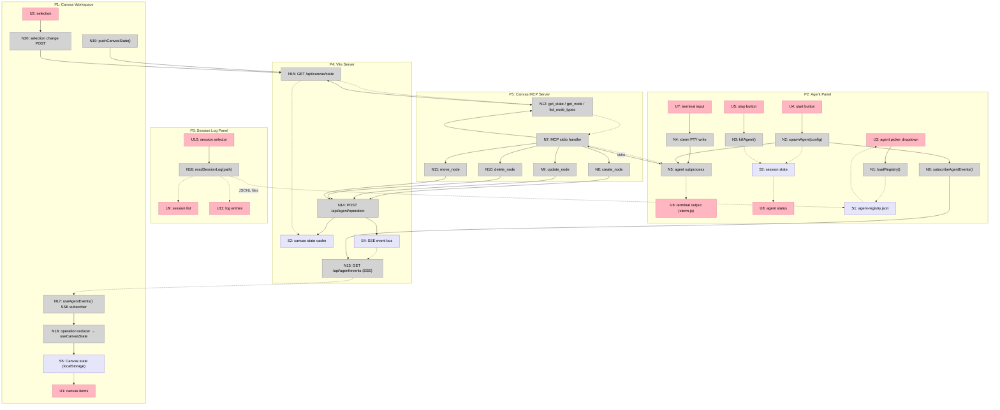

# Agentic Canvas — Shaping

## Frame

### Source

> I need to build a universal system to work with agents (code ones and others) with the canvas I've built — do tool calls and UI generation on canvas.

> I want to start with Claude Code and Codex — initially it can be a session of Codex or Claude Code in CLI inside canvas with outputs from AI agents rendering on canvas. I need the agent to see canvas context — artboards and nodes in a useful format for agents.

### Problem

The canvas is a capable visual workspace (embeds, media, components, artboards, scenes, theming) but it has no agent interface. There's no way for an AI agent to:

- Place items on the canvas via tool calls
- Stream its output into visual artifacts in real time
- Read what's already on the canvas to make informed decisions

Starting with two concrete agents — Claude Code and Codex CLI — both run as terminal sessions but have no way to see or manipulate the canvas they're running alongside.

### Outcome

A Claude Code or Codex CLI session runs inside the canvas. The agent can read canvas context (artboards, nodes, layout) in a format useful for reasoning. Agent output — generated UI, embeds, media, sections — renders as canvas items in real time. The user sees results appear and interacts with them using all existing canvas capabilities.

---

## Requirements (R)

| ID | Requirement | Status |
|----|-------------|--------|
| R0 | Agent session (Claude Code or Codex) runs inside the canvas with a chat/CLI panel | Core goal |
| R1 | Agent can read canvas context — artboards, nodes, layout — in a format useful for reasoning | Core goal |
| R2 | Agent output renders as canvas items (components, embeds, media, artboards) in real time | Core goal |
| R3 | Works with Claude Code and Codex CLI as first two agent types | Must-have |
| R4 | User can interact with agent-created items using all existing canvas capabilities | Must-have |
| R5 | Universal adapter — plug in any AI agent (Gemini, custom, future) not just CLI agents | Must-have |
| R6 | Observability — read agent session logs (JSONL) for tracing, not full replay | Must-have |
| R7 | Agent-native: atomic tool primitives, parity with user capabilities, dynamic discovery | Must-have |

---

## Protocol Landscape

Research found three layers that serve different purposes:

| Layer | Purpose | Protocol | Who supports it |
|-------|---------|----------|-----------------|
| Agent → Tools | Agent reads/writes canvas state | **MCP** | Claude Code, Codex CLI, Gemini CLI — all native |
| Agent → Frontend | Real-time UI streaming, state sync | **AG-UI** (CopilotKit) | CopilotKit, Google ADK, Oracle, Microsoft |
| Agent → Agent | Multi-agent orchestration | A2A, LangGraph | Google, LangChain |

**MCP is the non-negotiable base layer.** All three target agents support it natively. The canvas exposes an MCP server with atomic tools — any MCP client connects.

**The open question is the frontend layer** — how agent output streams into the canvas UI in real time.

See [research-agent-native.md](./research-agent-native.md) for full research findings.

---

## Shapes

All three shapes share the same MCP base (all agents speak MCP). They differ in how the frontend layer works — how agent actions reach the canvas UI.

### A: MCP + WebSocket bridge (own everything)

| Part | Mechanism | Flag |
|------|-----------|:----:|
| **A1** | **Canvas MCP server** — Node.js MCP server exposing atomic canvas tools (`create_node`, `update_node`, `delete_node`, `get_state`, `get_node`, `list_node_types`, `get_selection`) via stdio transport | |
| **A2** | **WebSocket bridge** — MCP server holds a WS connection to canvas frontend. Tool calls translate to canvas state mutations over WS. Canvas state reads go back through WS. | |
| **A3** | **CLI panel** — Embedded terminal panel in canvas UI. Spawns Claude Code or Codex CLI as subprocess with `--mcp-server` flag pointing to canvas MCP server. | |
| **A4** | **Canvas context resource** — MCP resource `canvas://state` returns artboards + nodes as structured JSON. Agent reads this to understand what's on canvas. | |
| **A5** | **Real-time render** — WS messages from MCP server trigger canvas state reducer. Items appear as they're created — same state path as manual user actions. | |
| **A6** | **Observability** — Read agent JSONL session logs from filesystem. Display in sidebar panel. | |
| **A7** | **Agent config registry** — JSON config mapping agent types to spawn commands and MCP connection params. Add new agent = add config entry. | |

### B: CopilotKit (AG-UI) + MCP

| Part | Mechanism | Flag |
|------|-----------|:----:|
| **B1** | **Canvas MCP server** — Same as A1. Atomic canvas tools via MCP. | |
| **B2** | **CopilotKit runtime** — AG-UI backend handles agent lifecycle, streams events (TextMessage, ToolCall, StateDelta) to frontend via SSE. | ⚠️ |
| **B3** | **CopilotKit React hooks** — `useCopilotChat` for chat panel, `useCopilotAction` to define frontend tool handlers that mutate canvas state. | ⚠️ |
| **B4** | **Chat panel** — CopilotKit's `<CopilotChat>` component or custom chat UI using AG-UI events. Replaces custom CLI panel. | ⚠️ |
| **B5** | **Canvas context via `useCopilotReadable`** — Expose canvas state to agent through CopilotKit's context system. Agent sees artboards/nodes as conversation context. | ⚠️ |
| **B6** | **Real-time render** — AG-UI `StateDelta` events (JSON Patch) applied to canvas state. Or `ToolCallEnd` events trigger canvas mutations. | ⚠️ |
| **B7** | **Observability** — CopilotKit provides run/step lifecycle events. Map to log viewer. | ⚠️ |
| **B8** | **Agent adapter per type** — CopilotKit runtime needs adapter per agent backend (LangGraph, custom, etc.). Claude Code/Codex as CLI subprocess needs custom AG-UI adapter wrapping their MCP interface. | ⚠️ |

### C: Custom thin adapter (MCP + own SSE stream)

| Part | Mechanism | Flag |
|------|-----------|:----:|
| **C1** | **Canvas MCP server** — Same as A1. Atomic canvas tools via MCP. | |
| **C2** | **SSE stream endpoint** — Lightweight `/api/agent/stream` endpoint. MCP server emits canvas operations as SSE events when tools are called. Frontend subscribes. | |
| **C3** | **CLI panel** — Same as A3. Embedded terminal spawning agent subprocesses with MCP config. | |
| **C4** | **Canvas context resource** — Same as A4. MCP resource for canvas state. | |
| **C5** | **Operation reducer** — Frontend SSE subscriber receives typed operations (`node_created`, `node_updated`, `node_deleted`) and applies them to canvas state. | |
| **C6** | **Observability** — Same as A6. Read JSONL from filesystem. | |
| **C7** | **Agent config registry** — Same as A7. JSON config for agent types. | |

---

## Fit Check

| Req | Requirement | Status | A | B | C |
|-----|-------------|--------|---|---|---|
| R0 | Agent session runs inside the canvas with a chat/CLI panel | Core goal | ✅ | ✅ | ✅ |
| R1 | Agent can read canvas context in a format useful for reasoning | Core goal | ✅ | ✅ | ✅ |
| R2 | Agent output renders as canvas items in real time | Core goal | ✅ | ❌ | ✅ |
| R3 | Works with Claude Code and Codex CLI as first two agent types | Must-have | ✅ | ❌ | ✅ |
| R4 | User can interact with agent-created items using all existing canvas capabilities | Must-have | ✅ | ✅ | ✅ |
| R5 | Universal adapter — plug in any AI agent not just CLI agents | Must-have | ✅ | ✅ | ✅ |
| R6 | Observability — read agent session logs (JSONL) for tracing | Must-have | ✅ | ❌ | ✅ |
| R7 | Agent-native: atomic tools, parity, dynamic discovery | Must-have | ✅ | ❌ | ✅ |

**Notes:**
- B fails R2: CopilotKit's state sync model (StateDelta/JSON Patch) doesn't natively map to canvas item creation. Canvas state reducer exists — AG-UI adds an abstraction layer between MCP tool calls and canvas mutations without clear benefit.
- B fails R3: Claude Code and Codex are CLI subprocesses that speak MCP via stdio. CopilotKit expects an AG-UI-compatible agent backend. Wrapping CLI agents into AG-UI requires a custom adapter per agent (B8 is ⚠️) — defeats the "universal" goal. CLI agents don't emit AG-UI events natively.
- B fails R6: CopilotKit has its own lifecycle events but doesn't read Claude Code/Codex JSONL logs. Would need custom integration anyway.
- B fails R7: CopilotKit's `useCopilotAction` defines tools from the frontend side — opposite of agent-native where the MCP server is the single tool source of truth. Creates two tool definition surfaces.
- B has 6 flagged unknowns (⚠️) — we don't concretely know how CopilotKit integrates with CLI agent subprocesses.

### AI-Native Architecture Comparison

| Dimension | A (MCP+WS) | B (CopilotKit) | C (MCP+SSE) |
|-----------|:---:|:---:|:---:|
| Single tool surface (MCP only) | ✅ | ❌ dual (MCP + frontend actions) | ✅ |
| Agent discovers capabilities at runtime | ✅ | ❌ frontend defines tools | ✅ |
| Agent is the reasoning core (not router) | ✅ | ❌ framework mediates | ✅ |
| Parity: agent can do everything user can | ✅ | ⚠️ limited by adapter | ✅ |
| New agent = config, not code | ✅ | ❌ needs AG-UI adapter per type | ✅ |
| No framework coupling | ✅ | ❌ CopilotKit runtime dependency | ✅ |
| Transport simplicity | ❌ WS reconnect logic | ❌ SSE + WS + AG-UI events | ✅ SSE auto-reconnect |

**Verdict:** A and C are both AI-native. C is simpler — SSE is unidirectional (push notifications only), MCP handles reads directly via resources. No bidirectional bridge needed.

---

## Selected Shape: D (collapsed A + C, SSE transport)

Shape D = C1 + C2 + C3 + C4 + C5 + C6 + C7, selecting SSE over WebSocket.

The architecture has three clean layers:

```
┌─────────────────────────────────────────────────┐
│  Canvas Frontend (React)                        │
│  ┌──────────┐  ┌──────────┐  ┌───────────────┐ │
│  │ CLI Panel │  │ Canvas   │  │ SSE Subscriber│ │
│  │ (xterm)  │  │ Workspace│  │ → Op Reducer  │ │
│  └──────────┘  └──────────┘  └───────────────┘ │
│       │                            ▲            │
│       │ spawns                     │ SSE events │
│       ▼                            │            │
│  ┌─────────────────────────────────┤            │
│  │  Agent Process (Claude Code /   │            │
│  │  Codex / Gemini CLI)            │            │
│  │       │                         │            │
│  │       │ stdio                   │            │
│  │       ▼                         │            │
│  │  ┌──────────────────────┐       │            │
│  │  │  Canvas MCP Server   │───────┘            │
│  │  │  • Tools (write)     │                    │
│  │  │  • Resources (read)  │                    │
│  │  │  • SSE emitter       │                    │
│  │  └──────────────────────┘                    │
│  └──────────────────────────────────────────────│
│                                                 │
│  ┌──────────────────────┐                       │
│  │  Agent Config        │                       │
│  │  Registry (JSON)     │                       │
│  └──────────────────────┘                       │
└─────────────────────────────────────────────────┘
```

### D: MCP server + SSE push (AI-native, own everything)

| Part | Mechanism |
|------|-----------|
| **D1** | **Canvas MCP server** |
| D1.1 | Node.js MCP server, stdio transport. Atomic tools: `create_node`, `update_node`, `delete_node`, `move_node`, `get_node`, `get_selection` |
| D1.2 | Discovery tool: `list_node_types` returns available types (`component`, `embed`, `media`, `artboard`) with their property schemas |
| D1.3 | Batch tool: `get_state` returns full canvas snapshot — artboards with children, freeform nodes, current selection |
| D1.4 | MCP resources: `canvas://state`, `canvas://artboard/{id}`, `canvas://node/{id}` for passive reads |
| **D2** | **Vite server hub + state cache** |
| D2.1 | Canvas state lives in browser only (localStorage + IndexedDB). MCP server is separate process — can't read browser state directly. |
| D2.2 | Vite middleware extended with in-memory state cache. Frontend pushes state snapshots on every meaningful change via `POST /api/canvas/state`. |
| D2.3 | MCP read tools (`get_state`, `get_node`) call `GET /api/canvas/state` on Vite server — reads from cache. |
| D2.4 | MCP write tools call `POST /api/agent/operation` on Vite server — updates cache + emits SSE. |
| **D3** | **SSE push to frontend** |
| D3.1 | Vite server emits SSE events on `GET /api/agent/events` when write operations arrive |
| D3.2 | Event types: `node_created`, `node_updated`, `node_deleted`, `node_moved`, `selection_changed` |
| D3.3 | Each event carries: `sessionId`, `sequenceId`, `operation`, `payload` (the node data) |
| **D4** | **CLI panel** |
| D4.1 | Embedded xterm.js terminal panel in canvas UI (resizable, dockable to side/bottom) |
| D4.2 | Spawns agent subprocess with MCP server connected: `claude --mcp-config canvas-mcp.json` or `codex --mcp-config canvas-mcp.toml` |
| D4.3 | Panel shows agent's native CLI output. User types prompts directly. |
| **D5** | **Canvas context for agents** |
| D5.1 | `get_state` returns structured JSON: artboard names, node types, positions, dimensions, text content, grouping |
| D5.2 | Format optimized for LLM reasoning — hierarchical, not flat. Artboard → children with summaries, not raw pixel data |
| D5.3 | `get_node` returns deep detail for a specific node including computed styles, embed URL, media source |
| **D6** | **Operation reducer (frontend)** |
| D6.1 | React hook `useAgentEvents(sessionId)` subscribes to SSE stream |
| D6.2 | Events dispatch into existing `useCanvasState` reducer — same mutation path as user actions |
| D6.3 | No special "agent item" type — agent-created nodes are identical to user-created nodes (R4 satisfied by design) |
| **D7** | **Observability** |
| D7.1 | Read Claude Code JSONL from `~/.claude/projects/*/sessions/*.jsonl` |
| D7.2 | Read Codex logs from equivalent path |
| D7.3 | Sidebar panel: session log viewer showing tool calls, results, timing |
| **D8** | **Agent config registry** |
| D8.1 | JSON file `agent-registry.json`: array of `{ id, name, spawn_command, mcp_config_template, log_path_pattern }` |
| D8.2 | Add new agent type = add entry to registry. No code changes. |
| D8.3 | CLI panel reads registry to offer agent picker dropdown |

---

## Fit Check: D

| Req | Requirement | Status | D | Satisfied by |
|-----|-------------|--------|---|--------------|
| R0 | Agent session runs inside the canvas with a chat/CLI panel | Core goal | ✅ | D4 (CLI panel with xterm.js) |
| R1 | Agent can read canvas context in a format useful for reasoning | Core goal | ✅ | D2 (state cache) + D5 (context format) + D1 (read tools) |
| R2 | Agent output renders as canvas items in real time | Core goal | ✅ | D1 (write tools) → D2 (POST) → D3 (SSE) → D6 (reducer) |
| R3 | Works with Claude Code and Codex CLI as first two agent types | Must-have | ✅ | D1 (MCP stdio) + D4 (spawns both) + D8 (config per type) |
| R4 | User can interact with agent-created items using all existing canvas capabilities | Must-have | ✅ | D6.3 (no special type — same as user-created) |
| R5 | Universal adapter — plug in any AI agent not just CLI agents | Must-have | ✅ | D8 (registry, new agent = config entry) + D1 (MCP is universal) |
| R6 | Observability — read agent session logs (JSONL) for tracing | Must-have | ✅ | D7 (reads JSONL, sidebar viewer) |
| R7 | Agent-native: atomic tools, parity, dynamic discovery | Must-have | ✅ | D1.1 (atomic tools) + D1.2 (list_node_types discovery) + D6.3 (parity) |

All requirements pass. No flagged unknowns.

---

## Detail D: Breadboard

### Key Architectural Insight

Canvas state lives only in the browser (localStorage + IndexedDB). The MCP server is a separate stdio process — it cannot read browser state directly. The **Vite server acts as a hub**: frontend pushes state snapshots to Vite, MCP server reads from Vite.

```
Agent ←stdio→ MCP Server ←HTTP→ Vite Server ←SSE/POST→ Canvas Frontend
                                     ↑
                              state cache (in-memory)
```

### Places

| # | Place | Description |
|---|-------|-------------|
| P1 | Canvas Workspace | Existing canvas where all items render and user interacts |
| P2 | Agent Panel | New dockable panel with agent picker + embedded terminal |
| P3 | Session Log Panel | New sidebar showing agent session observability |
| P4 | Vite Server | Existing backend middleware — extended with state cache + SSE |
| P5 | Canvas MCP Server | New separate Node.js process, stdio transport to agent |

### UI Affordances

| # | Place | Component | Affordance | Control | Wires Out | Returns To |
|---|-------|-----------|------------|---------|-----------|------------|
| U1 | P1 | CanvasWorkspace | canvas items (existing) | render | — | — |
| U2 | P1 | CanvasWorkspace | selection (existing) | click/drag | → N20 | — |
| U3 | P2 | AgentPanel | agent picker dropdown | select | → N1 | — |
| U4 | P2 | AgentPanel | start button | click | → N2 | — |
| U5 | P2 | AgentPanel | stop button | click | → N3 | — |
| U6 | P2 | AgentPanel | terminal output (xterm.js) | render | — | — |
| U7 | P2 | AgentPanel | terminal input | type | → N4 | — |
| U8 | P2 | AgentPanel | agent status indicator | render | — | — |
| U9 | P3 | SessionLogPanel | session list | render | — | — |
| U10 | P3 | SessionLogPanel | session selector | click | → N16 | — |
| U11 | P3 | SessionLogPanel | log entries (tool calls, timing) | render | — | — |

### Code Affordances

| # | Place | Component | Affordance | Control | Wires Out | Returns To |
|---|-------|-----------|------------|---------|-----------|------------|
| **Agent Panel lifecycle** | | | | | | |
| N1 | P2 | AgentPanel | `loadRegistry()` | call | — | → U3, S1 |
| N2 | P2 | AgentPanel | `spawnAgent(config)` | call | → N5, → N6 | → S3 |
| N3 | P2 | AgentPanel | `killAgent()` | call | — | → S3 |
| N4 | P2 | AgentPanel | xterm PTY write | call | — | → N5 |
| N5 | P2 | AgentPanel | agent subprocess (Claude Code / Codex) | process | → N7 (stdio) | → U6 |
| N6 | P2 | AgentPanel | `subscribeAgentEvents(sessionId)` | call | → N13 | — |
| **Canvas MCP Server (stdio process)** | | | | | | |
| N7 | P5 | CanvasMCP | MCP stdio handler | receive | → N8–N12 | → N5 |
| N8 | P5 | CanvasMCP | `create_node(type, properties)` | tool | → N14 | → N7 |
| N9 | P5 | CanvasMCP | `update_node(id, properties)` | tool | → N14 | → N7 |
| N10 | P5 | CanvasMCP | `delete_node(ids)` | tool | → N14 | → N7 |
| N11 | P5 | CanvasMCP | `move_node(id, x, y)` | tool | → N14 | → N7 |
| N12 | P5 | CanvasMCP | `get_state()` / `get_node(id)` / `get_selection()` / `list_node_types()` | tool | → N15 | → N7 |
| **Vite Server hub** | | | | | | |
| N13 | P4 | ViteMiddleware | `GET /api/agent/events` SSE endpoint | subscribe | — | → N6 |
| N14 | P4 | ViteMiddleware | `POST /api/agent/operation` | call | → S4 (emit SSE), → S2 | — |
| N15 | P4 | ViteMiddleware | `GET /api/canvas/state` | call | — | → N12, S2 |
| **Frontend state sync** | | | | | | |
| N16 | P3 | SessionLogPanel | `readSessionLog(path)` | call | — | → U9, U11 |
| N17 | P1 | CanvasWorkspace | `useAgentEvents(sessionId)` SSE subscriber | observe | → N18 | — |
| N18 | P1 | CanvasWorkspace | operation reducer → existing `useCanvasState` dispatch | call | → S5 | → U1 |
| N19 | P1 | CanvasWorkspace | `pushCanvasState()` on state change | call | → N15 (POST) | — |
| N20 | P1 | CanvasWorkspace | selection change → `POST /api/canvas/state` | call | → N15 | — |

### Data Stores

| # | Place | Store | Description |
|---|-------|-------|-------------|
| S1 | P2 | `agent-registry.json` | Agent type definitions: `{ id, name, spawn_command, mcp_config_template, log_path_pattern }[]` |
| S2 | P4 | Canvas state cache | In-memory copy of canvas state, updated by frontend POST (N19) and agent operations (N14) |
| S3 | P2 | Agent session state | `{ status: running|stopped|error, sessionId, pid }` |
| S4 | P4 | SSE event bus | Event emitter: `node_created`, `node_updated`, `node_deleted`, `node_moved` with `{ sessionId, sequenceId, operation, payload }` |
| S5 | P1 | Canvas state (existing) | `{ items: CanvasItem[], groups: CanvasGroup[], nextZIndex, selectedIds }` — localStorage + IndexedDB |

### Wiring Diagram



### Key Workflows

**1. User starts agent session:**
`U3 (pick agent) → U4 (start) → N2 (spawn) → N5 (subprocess with MCP) → N6 (subscribe SSE)`

**2. Agent reads canvas:**
`N5 (agent calls get_state) → N7 (stdio) → N12 (read tool) → N15 (Vite GET) → S2 (cache) → returns to agent`

**3. Agent creates item:**
`N5 (agent calls create_node) → N7 (stdio) → N8 (tool) → N14 (Vite POST) → S4 (emit SSE) + S2 (update cache) → N13 (SSE) → N17 (subscriber) → N18 (reducer) → S5 (canvas state) → U1 (item renders)`

**4. Frontend keeps server in sync:**
`S5 (canvas state changes) → N19 (push) → N15 (POST to Vite) → S2 (cache updated)`

---

## Challenge: CopilotKit First vs Build from Scratch

### The Honest Assessment

The fit check eliminated CopilotKit (Shape B) for the **final architecture** — it fails R3 (CLI agents), R6 (JSONL observability), R7 (dual tool surface). But for **testing the flow**, CopilotKit is ~90 lines of code:

| What CopilotKit gives you for free | Lines |
|-------------------------------------|-------|
| Chat panel (embeddable, customizable) | 10 |
| Canvas state → agent context (`useCopilotReadable`) | 5 |
| Canvas tools (`useCopilotAction` — create/update/delete) | 40-60 |
| Anthropic adapter (Claude API, direct) | 15 |
| **Total** | **~90** |

| What it CANNOT do | Why |
|-------------------|-----|
| Spawn Claude Code / Codex CLI | No subprocess support, API-only |
| Read JSONL session logs | Different observability model |
| Single MCP tool surface | Frontend defines tools separately |

### The Key Insight

**The riskiest assumption isn't the plumbing — it's the interaction model.** Does an agent reading canvas state and creating items actually produce useful results? Can it reason about artboard layout? Does the context format work for LLMs?

Building the full MCP + SSE + xterm.js + state cache infrastructure before validating the interaction model is building backwards.

### Revised Strategy: Test First, Build When Needed

```
V0: CopilotKit smoke test     → Validate interaction model
    ↓ (flow works?)
V1: MCP server + state cache  → Enable CLI agents (Claude Code, Codex)
V2: CLI panel (xterm.js)      → Native CLI experience
V3: SSE pipeline              → Real-time from MCP to canvas
V4: Observability              → JSONL log viewer
V5: Agent registry            → Multi-agent config
```

**V0 tests the hard question cheaply. V1-V5 build the hard infrastructure only if V0 validates the concept.**

### Decision Gate After V0

| Signal | Action |
|--------|--------|
| Agent creates useful canvas items from context | ✅ Proceed to V1 — MCP for CLI agents |
| Chat UX works well for this use case | Consider keeping CopilotKit chat alongside MCP CLI panel |
| Agent can't reason well about canvas structure | Stop — improve context format (D5) before building more |
| Claude API is sufficient, CLI not needed | CopilotKit may be the final solution — skip V1-V3 |

---

## Slices

### V0: CopilotKit Smoke Test

**Goal:** Validate the interaction model — can an agent read canvas and create meaningful items?

**Setup (~90 lines):**
- `npm install @copilotkit/react-core @copilotkit/react-ui @copilotkit/runtime @anthropic-ai/sdk`
- Add CopilotKit runtime endpoint to Vite server middleware (Express adapter)
- Wrap app in `<CopilotKit>` provider
- Add `<CopilotChat>` as dockable side panel

**Affordances (all new, CopilotKit-provided):**

| # | Affordance | Part | Notes |
|---|------------|------|-------|
| U-V0.1 | Chat panel (`CopilotChat`) | D4 equivalent | CopilotKit component, side panel |
| N-V0.1 | `useCopilotReadable({ value: canvasItems })` | D5 equivalent | Exposes canvas state to agent |
| N-V0.2 | `useCopilotReadable({ value: artboards })` with `parentId` | D5 equivalent | Hierarchical context |
| N-V0.3 | `useCopilotAction("createCanvasItem")` | D1 equivalent | Agent creates items → calls existing `addItem()` |
| N-V0.4 | `useCopilotAction("updateCanvasItem")` | D1 equivalent | Agent updates items → calls existing `updateItem()` |
| N-V0.5 | `useCopilotAction("deleteCanvasItems")` | D1 equivalent | Agent deletes items |
| N-V0.6 | `useCopilotAction("listNodeTypes")` | D1.2 equivalent | Discovery — returns available types + schemas |
| N-V0.7 | CopilotKit runtime (AnthropicAdapter) | — | Backend, Claude API |

**Demo:** "Open chat, say 'create a 2x2 grid of artboards with a component in each', items appear on canvas"

**What V0 validates:**
- Can the agent reason about canvas layout from serialized state?
- Does the create/update/delete action flow work?
- Is the chat UX appropriate or do we need a CLI panel?
- How well does Claude handle spatial reasoning (positions, artboard nesting)?

---

### V1: Canvas MCP Server + State Cache

**Gate:** V0 validates the interaction model works.

**Goal:** Enable Claude Code and Codex CLI to use the canvas via MCP tools.

**Affordances from breadboard:**

| # | Affordance | Part |
|---|------------|------|
| N7 | MCP stdio handler | D1 |
| N8–N11 | Write tools: `create_node`, `update_node`, `delete_node`, `move_node` | D1.1 |
| N12 | Read tools: `get_state`, `get_node`, `get_selection`, `list_node_types` | D1.2, D1.3 |
| N15 | `GET /api/canvas/state` endpoint | D2.3 |
| N14 | `POST /api/agent/operation` endpoint | D2.4 |
| S2 | In-memory canvas state cache | D2.2 |
| N19 | `pushCanvasState()` — frontend syncs to server | D2.2 |

**Demo:** "Run `node canvas-mcp-server.js` in terminal, call `create_node` via MCP inspector tool, item appears on canvas"

---

### V2: CLI Panel (xterm.js)

**Goal:** Agent session runs inside the canvas UI.

**Affordances from breadboard:**

| # | Affordance | Part |
|---|------------|------|
| U3 | Agent picker dropdown | D8.3 |
| U4, U5 | Start/stop buttons | D4 |
| U6 | Terminal output (xterm.js) | D4.1 |
| U7 | Terminal input | D4.3 |
| U8 | Agent status indicator | D4 |
| N2 | `spawnAgent(config)` | D4.2 |
| N3 | `killAgent()` | D4 |
| N4 | xterm PTY write | D4 |
| N5 | Agent subprocess | D4.2 |
| S3 | Agent session state | D4 |

**Demo:** "Pick Claude Code from dropdown, click Start, type 'add an artboard with 3 component cards', items appear on canvas while agent output streams in terminal"

---

### V3: SSE Pipeline (Real-time MCP → Canvas)

**Goal:** Agent tool calls render canvas items in real time.

**Affordances from breadboard:**

| # | Affordance | Part |
|---|------------|------|
| N13 | `GET /api/agent/events` SSE endpoint | D3.1 |
| S4 | SSE event bus | D3.2, D3.3 |
| N17 | `useAgentEvents(sessionId)` SSE subscriber | D6.1 |
| N18 | Operation reducer → `useCanvasState` dispatch | D6.2 |
| N6 | `subscribeAgentEvents()` in Agent Panel | D3 |

**Demo:** "Agent creates 5 items in rapid succession, each appears on canvas within 100ms of the tool call"

---

### V4: Observability

**Goal:** See what the agent did and when.

**Affordances from breadboard:**

| # | Affordance | Part |
|---|------------|------|
| U9 | Session list | D7.3 |
| U10 | Session selector | D7.3 |
| U11 | Log entries (tool calls, timing) | D7.3 |
| N16 | `readSessionLog(path)` | D7.1, D7.2 |

**Demo:** "After agent session, open log panel, see each tool call with timing and result"

---

### V5: Agent Config Registry

**Goal:** Add new agent types without code changes.

**Affordances from breadboard:**

| # | Affordance | Part |
|---|------------|------|
| S1 | `agent-registry.json` | D8.1 |
| N1 | `loadRegistry()` | D8.3 |

**Demo:** "Add Gemini CLI entry to registry JSON, it appears in agent picker dropdown, start session"

---

### Slice Summary

| # | Slice | Build/Buy | Effort | Demo | Gate |
|---|-------|-----------|--------|------|------|
| **V0** | CopilotKit smoke test | **Buy** (CopilotKit) | ~90 LOC | "Chat → items appear on canvas" | — |
| **V1** | MCP server + state cache | Build | Medium | "MCP tool call → item on canvas" | V0 validates flow |
| **V2** | CLI panel (xterm.js) | Build | Medium | "Claude Code in terminal → canvas" | V1 works |
| **V3** | SSE pipeline | Build | Small | "Real-time tool → canvas render" | V2 works |
| **V4** | Observability | Build | Small | "See tool call log" | V1 works |
| **V5** | Agent registry | Build | Small | "Add agent to JSON, appears in picker" | V2 works |

**Note:** V0 may prove CopilotKit is sufficient for many use cases. The chat UI could live alongside the CLI panel permanently — CopilotKit for API agents (Gemini, Claude API), CLI panel for CLI agents (Claude Code, Codex).

---
